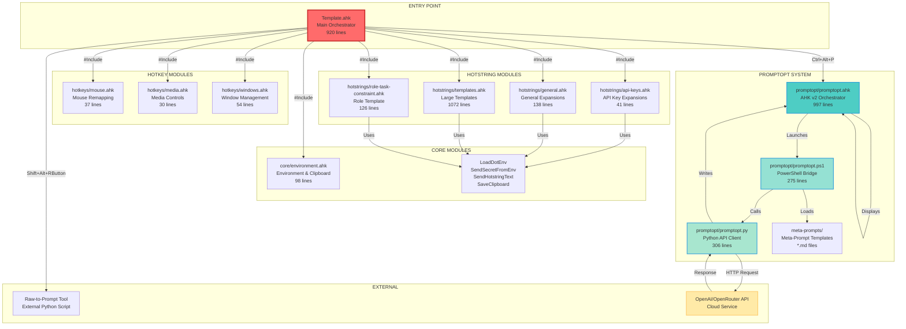
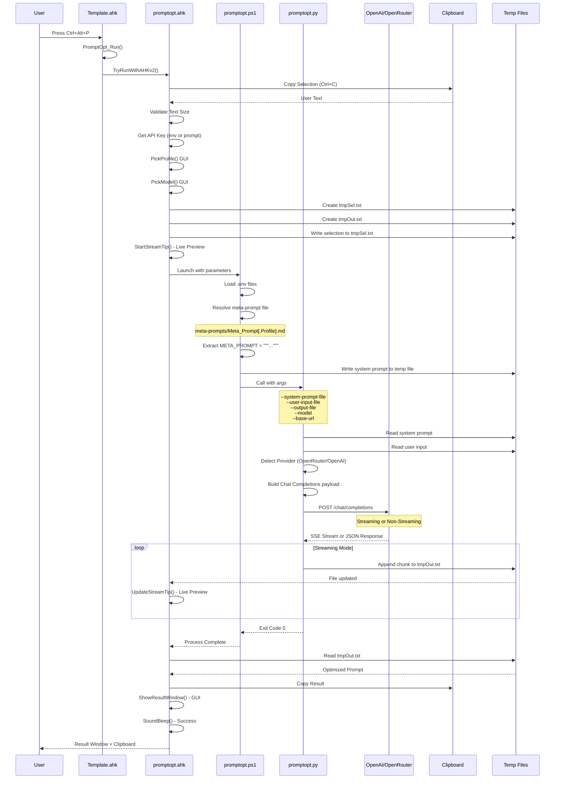
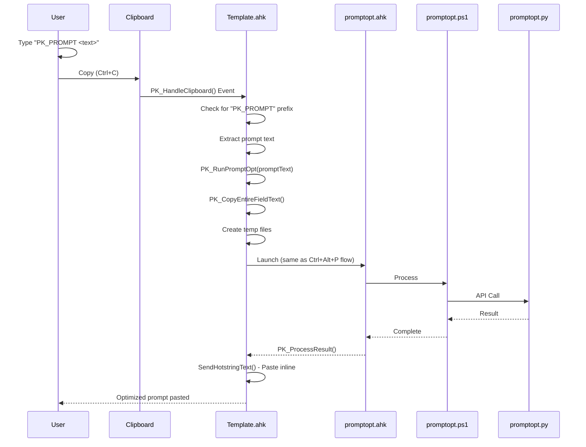
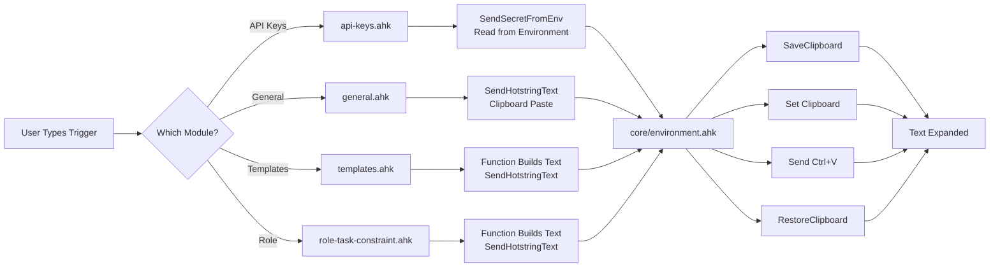
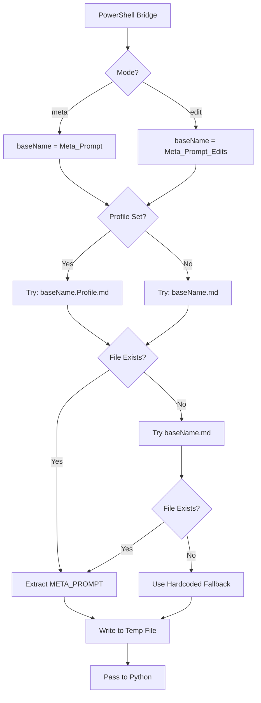
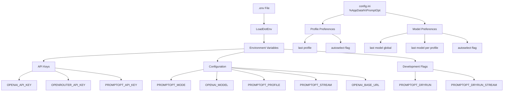
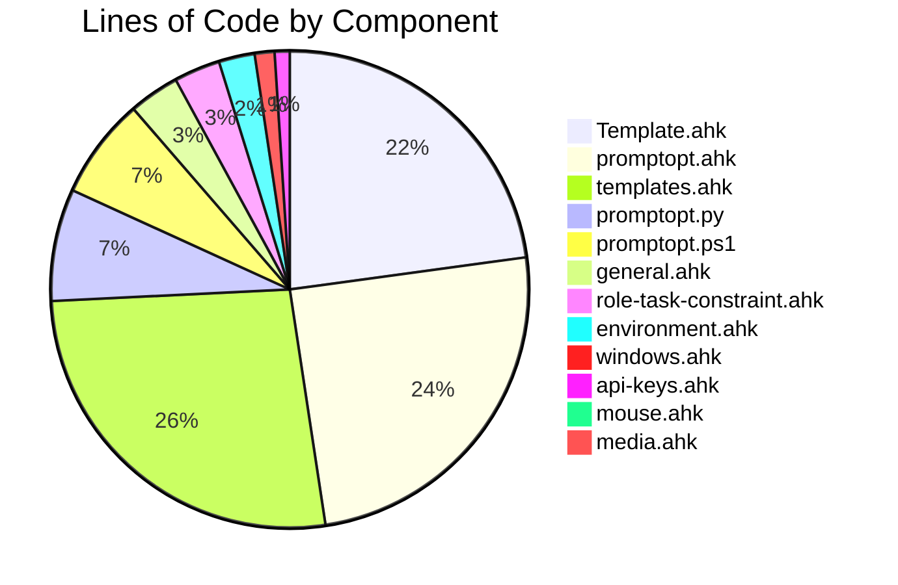
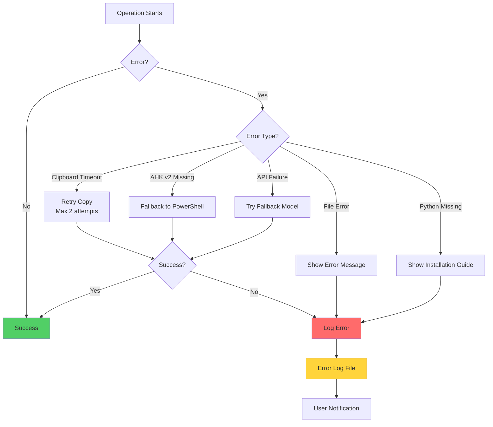
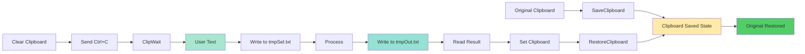
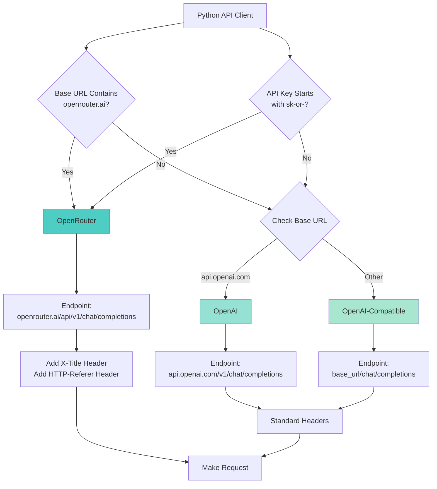

# PromptOpt System - Visual Code Map

## Complete System Architecture

## PromptOpt Execution Flow (Detailed)

## PK_PROMPT Automation Flow

## Hotstring Expansion Flow

## Meta-Prompt Resolution Logic

## Configuration & Environment Flow

## File Size & Complexity Overview

## Error Handling & Recovery Paths

## Data Flow: Clipboard & Temp Files

## Provider Detection & API Routing

